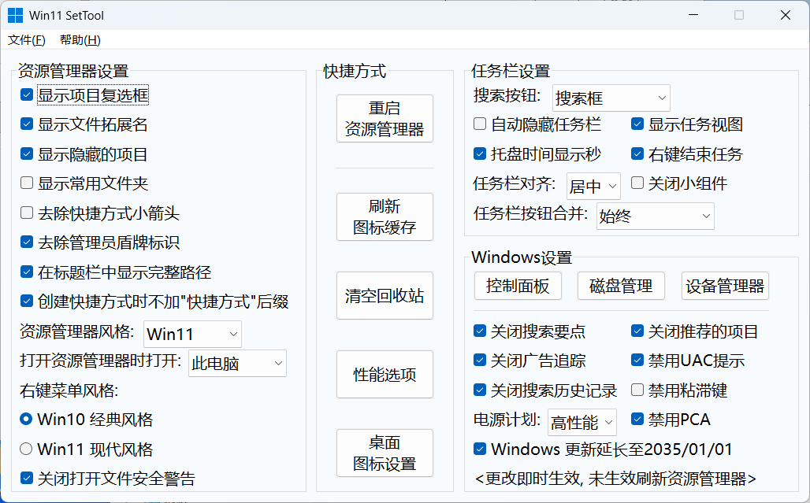

# Win11-SetTool
> Windows 11 系统设置工具 - 基于 AutoHotkey v2.0

## 界面预览

## 快速开始

### 方法 1：直接使用
1. 下载 [Release](https://github.com/Zerin-emm/Win11-SetTool/releases) 中的 `Win11_SetTool_x64.exe`
2. 已关闭UAC-双击运行
3. 未关闭UAC-右键-以管理员身份运行/双击运行+UAC弹窗点击 是

### 方法 2：从源码运行
1. 安装 [AutoHotkey v2](https://www.autohotkey.com/)
2. 克隆仓库：`git clone https://github.com/你的用户名/Win11-SetTool.git`
3. 双击 `AHK.ahk` 运行

## 开发环境

- AutoHotkey v2.0+
- Windows 10/11 x64
- 管理员权限

### 推荐编辑器
- [Visual Studio Code](https://code.visualstudio.com/) + [AHK++ 插件]
- 任意文本编辑器
